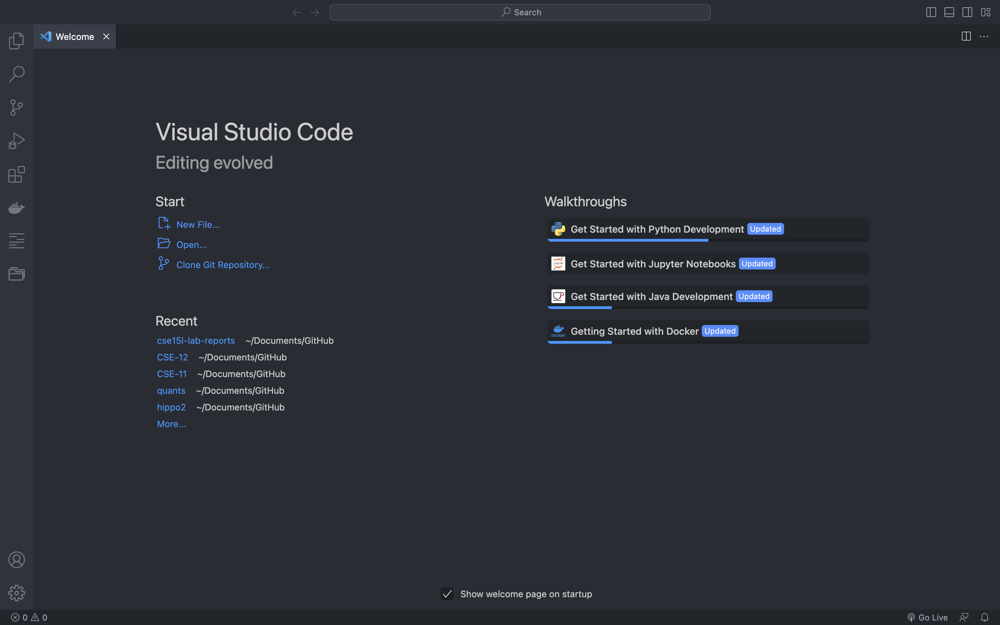
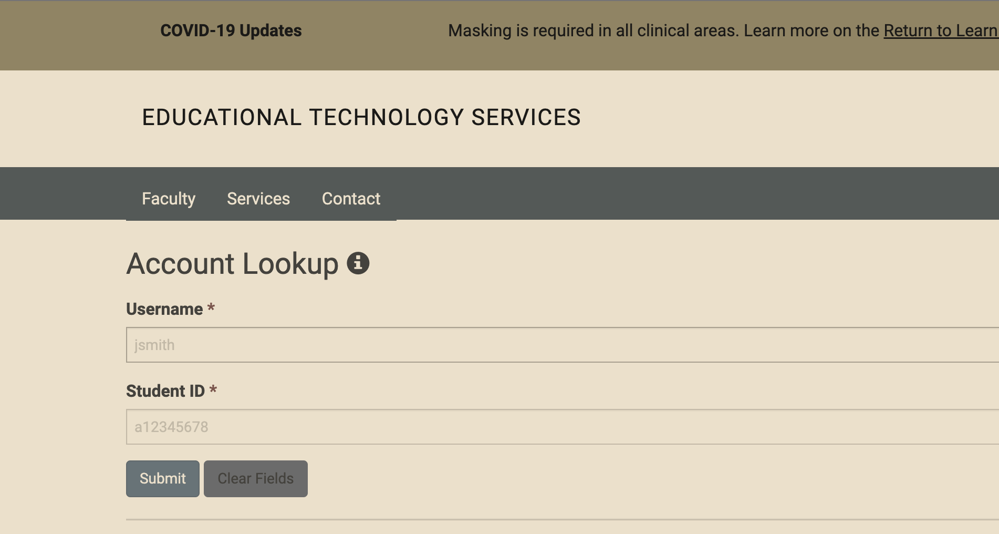
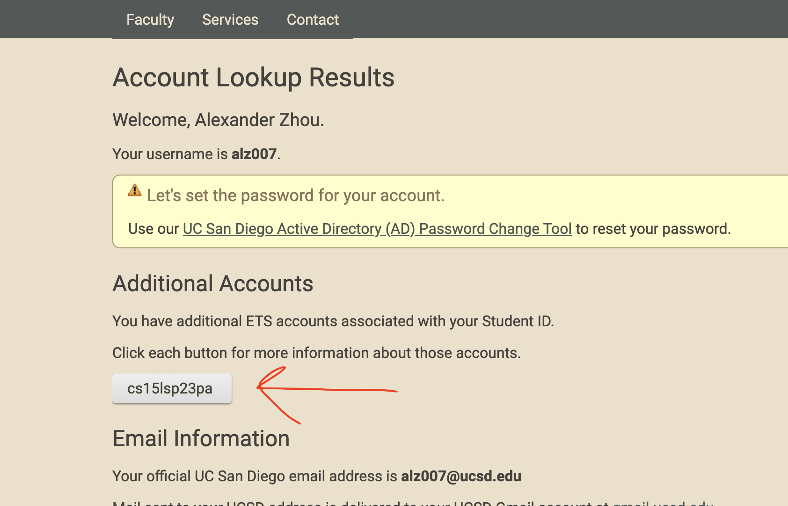
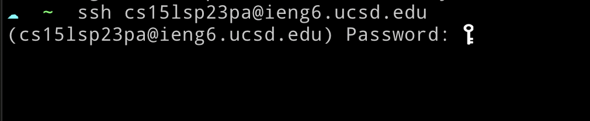
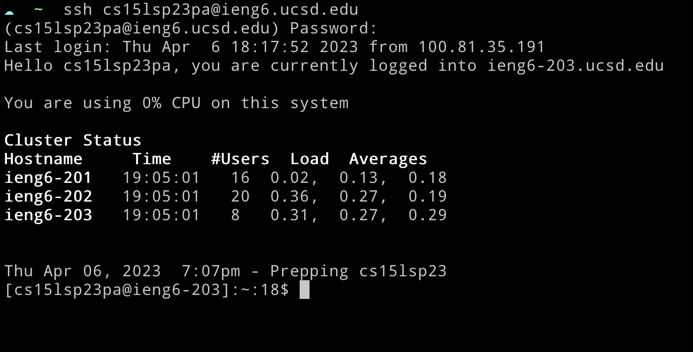
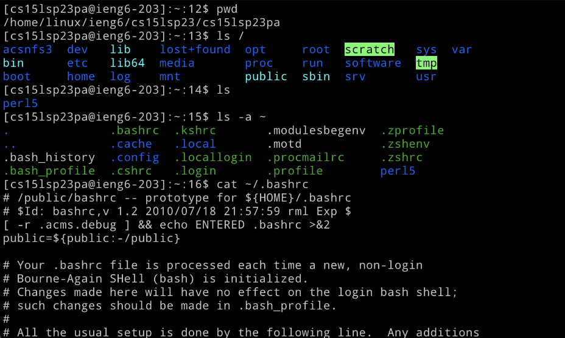

# Lab Report 1 (4/6/23)

## Summary
Following are the steps to setup and login to your cse15L user via ssh on the remote server.  <br><br>

### 1. Installing VSCode
Go to [https://code.visualstudio.com/](https://code.visualstudio.com/) and install VSCode for your OS. I've already installed it previously, but you should see something like this once opened:

<br><br>
### 2. Find your account username
First you want to find the username for your cse15L account so you can reset its password. Go to [https://sdacs.ucsd.edu/~icc/index.php](https://sdacs.ucsd.edu/~icc/index.php) and enter in your UCSD credentials. 

<br><br>
### 3. Select the CSE15L account
Under "Additional Accounts," click the one that starts with the class code and follow the instructions to reset the account's password.

<br><br>
### 4. SSH using the account
After the account's password has been successfully reset (it may take up to 30 minutes), you can now attempt to login to it on the remote server via ssh. First open a new terminal session (in vscode: `terminal` -> `new terminal`), then enter in
```bash
ssh <username>@ieng6.ucsd.edu
```
Where `<username>` refers to your account's username. 
<br><br>
### 5. Enter in your password
It'll prompt you to enter in your account's password. 

<br><br>
### 6. Login
If the login succeeded, then you should see something like this:

<br><br>
### 7. Try different commands
You can now try different commands to explore the directory structure and other things. 

<br><br>Here are descriptions about the commands used in the screenshot:
<table>
    <tr>
        <th>Command</th>
        <th>Description</th>
    </tr>
    <tr>
        <td>pwd</td>
        <td>prints the current working directory</td>
    </tr>
    <tr>
        <td>ls</td>
        <td>ls displays all the files and directories in a given directory. In this case, it is listing all the items in the current working directory.</td>
    </tr>
    <tr>
        <td>ls /</td>
        <td>Here, ls is used to list all the items in the root folder of the server.</td>
    </tr>
    <tr>
        <td>ls -a ~</td>
        <td>The "-a" flag tells ls to display hidden files as well, and ~ is a shortcut to the user's home directory</td>
    </tr>
    <tr>
        <td>cat ~/.bashrc</td>
        <td>cat stands for "concatenate," which combines all the text in the listed files. Here, only the ~/.bashrc file is given, so it only displays the text contained inside the .bashrc file. The .bashrc file contains configurations for the bash shell.</td>
    </tr>
</table>

<br>Some other commands that you can try:
<table>
    <tr>
        <th>Command</th>
        <th>Description</th>
    </tr>
    <tr>
        <td>cd _path_</td>
        <td>change directory; navigates through the directory tree or changes the current working directory</td>
    </tr>
    <tr>
        <td>cp _path1_ _path2_</td>
        <td>copy a file from path1 to path2</td>
    </tr>
    <tr>
        <td>mv _path1_ _path2_</td>
        <td>move a file from path1 to path2</td>
    </tr>
    <tr>
        <td>exit</td>
        <td>Closes the ssh connection</td>
    </tr>
    <tr>
        <td>mkdir _name_</td>
        <td>creates a new directory in the current working directory with the given name</td>
    </tr>
</table>