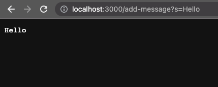
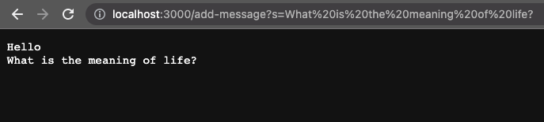
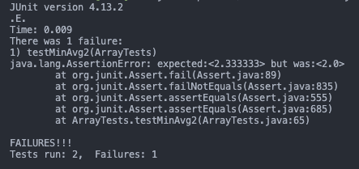
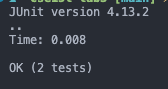

# Lab Report 2 (4/20/23)

## Part 1
### Code
Here's the code for a server that implements a `/add-message?s=<string>` route that adds the `s` query parameter's value to a string in memory.
```java
import java.io.IOException;
import java.net.URI;
import java.util.ArrayList;
import java.util.Random;

class StringHandler implements URLHandler {
    String message = "";
    public String handleRequest(URI url) {
        String path = url.getPath();

        if (path.contains("add-message")) {
            String[] parameters = url.getQuery().split("=");
            if (parameters[0].equals("s")) {
                String newLine = parameters[1];
                message += newLine + "\n";
                return message;
            } else {
                return "400 invalid parameters";
            }
        } else {
            return "404 not found";
        }
    }
}

class StringServer {
    public static void main(String[] args) throws IOException {
        if(args.length == 0){
            System.out.println("Missing port number! Try any number between 1024 to 49151");
            return;
        }
        int port = Integer.parseInt(args[0]);
        Server.start(port, new StringHandler());
    }
}
```
<br>This code depends on `Server.java` from the second lab. 

```java
// A simple web server using Java's built-in HttpServer

// Examples from https://dzone.com/articles/simple-http-server-in-java were useful references

import java.io.IOException;
import java.io.OutputStream;
import java.net.InetSocketAddress;
import java.net.URI;

import com.sun.net.httpserver.HttpExchange;
import com.sun.net.httpserver.HttpHandler;
import com.sun.net.httpserver.HttpServer;

interface URLHandler {
    String handleRequest(URI url);
}

class ServerHttpHandler implements HttpHandler {
    URLHandler handler;
    ServerHttpHandler(URLHandler handler) {
      this.handler = handler;
    }
    public void handle(final HttpExchange exchange) throws IOException {
        // form return body after being handled by program
        try {
            String ret = handler.handleRequest(exchange.getRequestURI());
            // form the return string and write it on the browser
            exchange.sendResponseHeaders(200, ret.getBytes().length);
            OutputStream os = exchange.getResponseBody();
            os.write(ret.getBytes());
            os.close();
        } catch(Exception e) {
            String response = e.toString();
            exchange.sendResponseHeaders(500, response.getBytes().length);
            OutputStream os = exchange.getResponseBody();
            os.write(response.getBytes());
            os.close();
        }
    }
}

public class Server {
    public static void start(int port, URLHandler handler) throws IOException {
        HttpServer server = HttpServer.create(new InetSocketAddress(port), 0);

        //create request entrypoint
        server.createContext("/", new ServerHttpHandler(handler));

        //start the server
        server.start();
        System.out.println("Server Started! Visit http://localhost:" + port + " to visit.");
    }
}
```
<br>

### Examples
Here is an example of using `Hello` for the `s` parameter. 


1. When the webserver receives a request, it passes the request url as a `URI` to the `handleRequest` method of the `StringHandler` class. In this case, the url is `http://localhost:3000/add-message?s=Hello`.
2. The `handleRequest` method first gets the `path` of the url, which should be something like `/add-message`. 
3. Since the `path` contains `"add-message"`, the code then gets the query string, which should be something like `s=Hello` in this case. 
4. The query string is split by `=`, and there is a check to make sure that the query parameter is the expected `s` param. 
5. If the check passes, then the value after the `=`, `Hello`, is appended to the `message` field of the `StringHandler` class with a newline.  
6. After appending, the handler then simple returns the current value of `message`. 
7. If the route did not match or the query param was not `s`, then the server would return a 400 or 404 status code message. 

<br>
Here is a followup example


1. Similar to before, the `url` is passed to the `handleRequest` method (`http://localhost:3000/add-message?s=What is the meaning of life?` [spaces get url-encoded]).
2. Since the `path` contains `"add-message"`, it continues to parse the query string.
3. It finds the `s` parameter, and grabs its value (`What is the meaning of life?` in this case).
4. Next, it appends it to the current `message` field, which already has `Hello\n` from the request before. 
5. As a result, it now returns `"Hello\nWhat is the meaning of life?\n"`, which is what we see displayed in the browser.

## Part 2

Here is the `averageWithoutLowest` method from `ArrayExamples.java`:
```java
// Averages the numbers in the array (takes the mean), but leaves out the
// lowest number when calculating. Returns 0 if there are no elements or just
// 1 element in the array
static double averageWithoutLowest(double[] arr) {
    if(arr.length < 2) { return 0.0; }
    double lowest = arr[0];
    for(double num: arr) {
        if(num < lowest) { lowest = num; }
    }
    double sum = 0;
    for(double num: arr) {
        if(num != lowest) { sum += num; }
    }
    return sum / (arr.length - 1);
}
```
<br>

Here is a test that passes
```java
@Test
public void testMinAvg() {
    double nums[] = { 1, 2, 3, 4, 5, 6, 7, 8, 9, 10 };
    assertEquals(6, ArrayExamples.averageWithoutLowest(nums), 0.0001);
}
```
<br>
Here is a test that fails

```java
@Test
public void testMinAvg2() {
    double nums[] = { 1, 1, 2, 4 };
    assertEquals(2.333333, ArrayExamples.averageWithoutLowest(nums), 0.0001);
}
```
<br>

Here is the output of running the tests


<br>

Looking at the `averageWithoutLowest` code, it seems that in the case that there are multiple instances of the lowest value, the code ignores them while summing despite including them in the final average calculation with `arr.length - 1`. <br>
Assuming that _all_ lowest values should be ignored, a fix will be the following:
```java
// Averages the numbers in the array (takes the mean), but leaves out the
// lowest number when calculating. Returns 0 if there are no elements or just
// 1 element in the array
static double averageWithoutLowest(double[] arr) {
    if(arr.length < 2) { return 0.0; }
    double lowest = arr[0];
    for(double num: arr) {
        if(num < lowest) { lowest = num; }
    }
    double sum = 0;
    int count = 0; // add this
    for(double num: arr) {
        if(num != lowest) {
            sum += num; 
            count++; // add this
        }
    }
    // return sum / (arr.length - 1);
    return sum / count;
}
```
Here, instead of using the length of `arr` as the denominator, we create a `count` local variable to keep track of the number of non-minimum elements in the array to correctly calculate the averge in this case. <br><br>

Otherwise, assuming that at maximum only one element should be ignored, then the following will be a fix:
```java
// Averages the numbers in the array (takes the mean), but leaves out the
// lowest number when calculating. Returns 0 if there are no elements or just
// 1 element in the array
static double averageWithoutLowest(double[] arr) {
    if(arr.length < 2) { return 0.0; }
    double lowest = arr[0];
    for(double num: arr) {
        if(num < lowest) { lowest = num; }
    }
    double sum = 0;
    boolean ignoredMinimum = false; // flag to check if min has been ignored
    for(double num: arr) {
        // check if it has ignored the min already
        if(ignoredMinimum || num != lowest) {
            sum += num; 
        } else { // ignore minimum and set flag to true
            ignoredMinimum = true;
        }
    }
    return sum / (arr.length - 1);
}
```
Here, we create a local variable `ignoredMinimum` to act as a flag that tracks whether we've ignored the minimum value yet. Then, in the for loop, we sum the number if the minimum has been ignored already or if the value is not the minimum. Else we ignore the minimum and set the flag to true. 
<br><br>
With this change, the tests pass



## Part 3
One thing that I learned was that, when compiling java files that depend on another java file, you'll have to compile them all at the same time. More specifically, I have to compile `Server.java` and my webserver request handler code together (`javac Server.java myServer.java`). Otherwise, just compiling my code by itself errors and fails since the compiler can't find the class and interface for the server and urlhandler.  