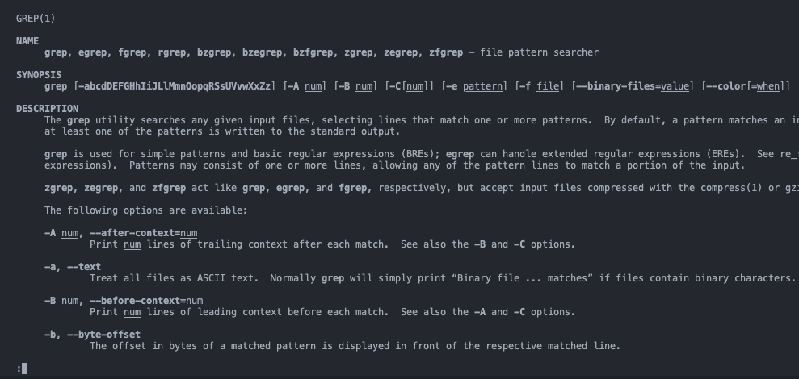
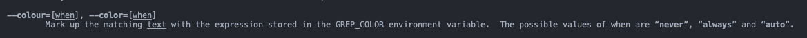
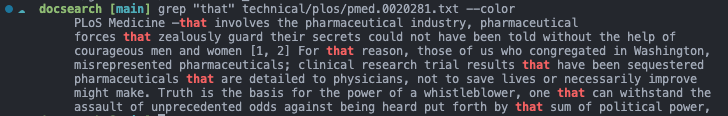
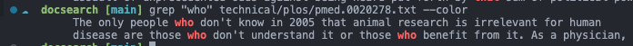
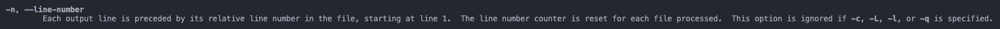
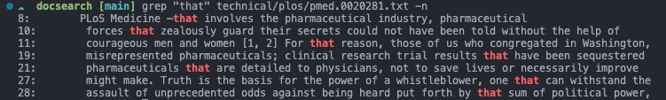
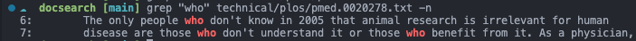
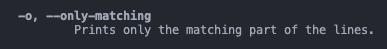
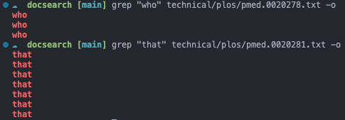

# Lab Report 3 (5/3/23)
### Command-line Options
In this report, we'll examine `grep` and its various options. <br>
To view a command's options, you can either search up online documentation or run the manual command (`man <command>`).<br><br>

Here is the manual for `grep`
```bash
man grep
```


<br>

### Color
The first option we'll look at is `color`. Here is the manual description:

<br><br>
As you can see, this option causes matching text to be highlighted. Below are two examples:
```bash
grep "that" technical/plos/pmed.0020281.txt --color
grep "who" technical/plos/pmed.0020278.txt --color
```


<br><br>
Here the matchng text (`that` and `who`) is highlighted in red. We can also provide additional arguments to remove it:
```bash
grep "who" technical/plos/pmed.0020278.txt --color=never
```

<br><br>

### Max-count
Next we'll check out the `max-count` option. This lets us specify the maximum number of lines to match to. 


<br>

Using it in the examples before, we can limit the number of lines displayed:
```bash
grep "that" technical/plos/pmed.0020281.txt -m 2
grep "who" technical/plos/pmed.0020278.txt -m 1
```


<br>
As you can see, the first query was limited to 2 lines and the second, 1.
<br><br>


### Line-Number
This option displays the line numbers from where the line was matched.

<br><br>

Using it is fairly straightforward:
```bash
grep "that" technical/plos/pmed.0020281.txt -n
grep "who" technical/plos/pmed.0020278.txt -n
```


<br>
<br>
Here the line numbers are displayed at the very left.

<br>

### Only-matching
Finally, this option only displays the matching parts of lines.



<br>

```bash
grep "who" technical/plos/pmed.0020278.txt -o
grep "that" technical/plos/pmed.0020281.txt -o
```


<br>

Here, all the matches were returned instead of the lines themselves. It also returned multiple matches if the line had multiple matches, which can make this useful for counting the number of a certain word within a file when paired with `wc`. 
