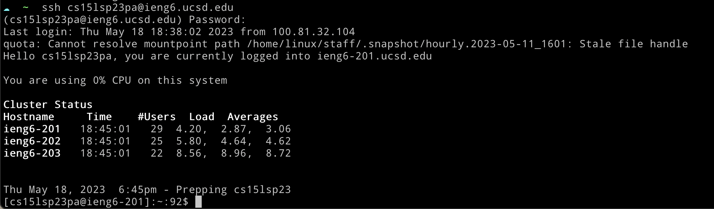
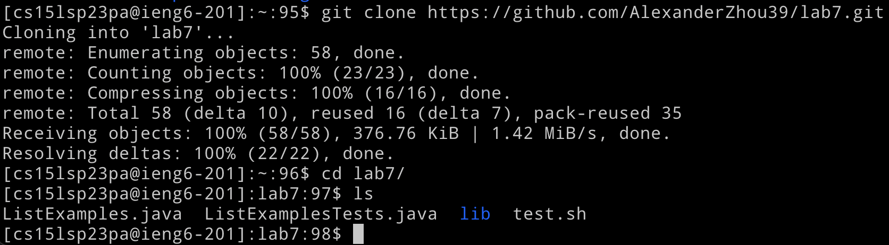
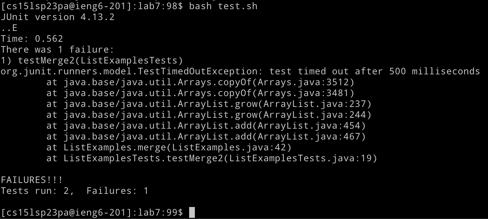
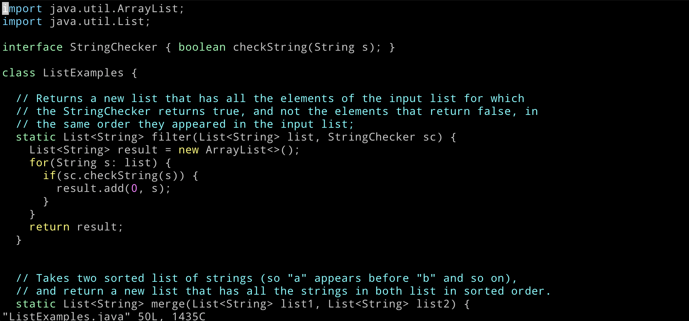
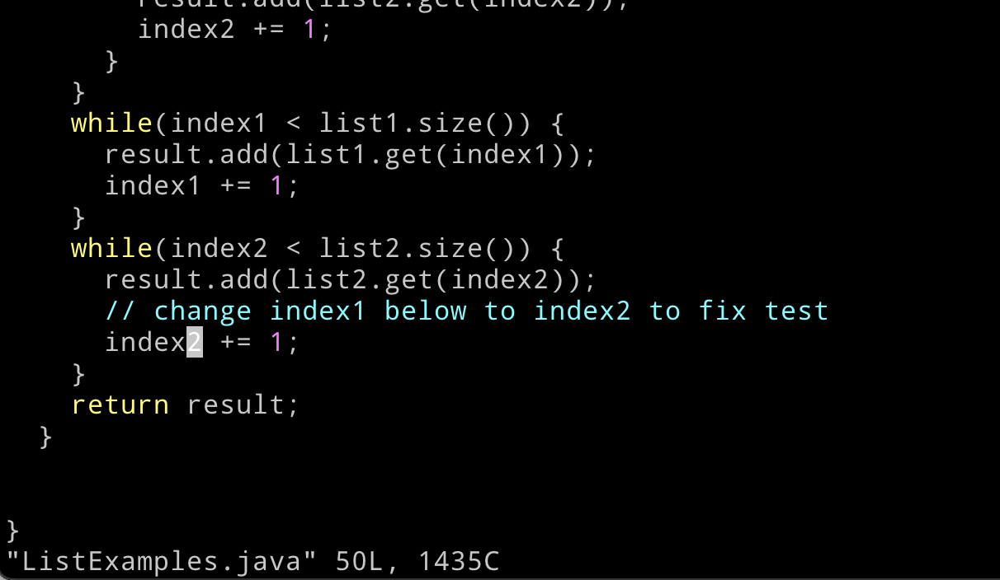
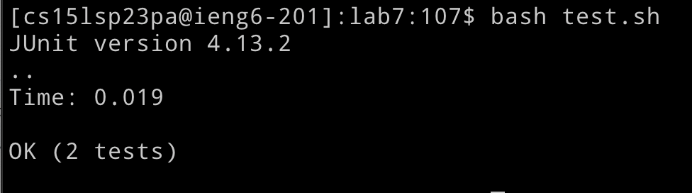
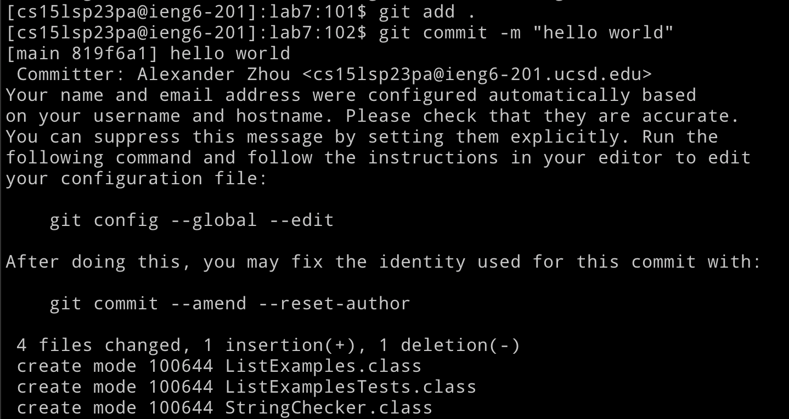
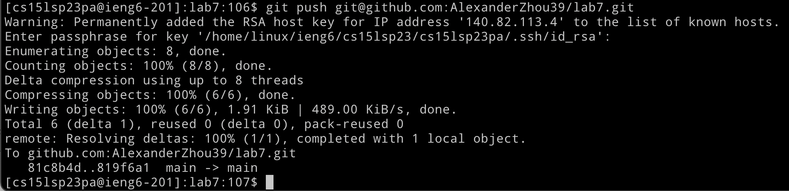

# Lab Report 4 (5/18/23)

### 1. SSH into remote server

First, ssh into ieng6

```bash
ssh cs15lsp23__@ieng6.ucsd.edu
```

It'll prompt you for your password to login. Afterwards you should have a shell on the remote server.



<br>

I had the command in my history already, so I only had to enter

```bash
<up> <enter>
```

To bring up the last command (ssh) and execute it.

<br>

### 2. Clone the repository

Next, clone the repository and cd into it.

```bash
git clone https://github.com/AlexanderZhou39/lab7.git

cd lab7
```



### 3. Run tests

Now we can execute the existing test script to run existing tests

```bash
bash test.sh
```



### 4. Open the file in vim

Next we open the problem file with vim

```bash
vim ListExamples.java
```



### 5. Make the fix

To quickly make the fix, we can enter the following keys

```bash
gg ?index1 <enter> e cl 2 :wq
```

First, `gg` brings the cursor to the end of the file, and `?index1 <enter>` does a backwards search for `index1`. Next, `e` brings the cursor to the end of `index1` and `cl` deletes the last character and enters insert mode. Finally we add `2` to the end of `index` and save the file with `:wq`.



### 6. Retest code

To check that the code has been fixed, we can rerun the test script. Since we executed it two commands ago, we only need to enter

```
<up> <up> <enter>
```

to go back two commands and re-execute it.


<br>

### 7. Commit the change

Next we can stage the files and commit the change to git.

```bash
git add .
git commit -m "fix bug"
```



### 8. Push changes to github

Finally we push our changes to the git repository.

```bash
git push git@github.com:AlexanderZhou39/lab7.git
```

Here I use the ssh url to authenticate with github via ssh.


