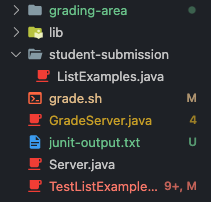

# Lab Report 5

## Part 1

### **Student**
What environment are you using (computer, operating system, web browser, terminal/editor, and so on)?
<br><br>
`MacOS, VSCode terminal`
<br><br>

Detail the symptom you're seeing. Be specific; include both what you're seeing and what you expected to see instead. Screenshots are great, copy-pasted terminal output is also great. Avoid saying “it doesn't work”.
<br><br>
Compiler cannot find `StringChecker` and `ListExamples`. JUnit cannot find TestListExamples class. Bash script should be compiling java files and running JUnit tests on cloned repository.

```bash
$ bash grade.sh https://github.com/ucsd-cse15l-s23/list-examples-duplicates
Cloning into 'student-submission'...
remote: Enumerating objects: 6, done.
remote: Counting objects: 100% (6/6), done.
remote: Compressing objects: 100% (3/3), done.
remote: Total 6 (delta 1), reused 6 (delta 1), pack-reused 0
Receiving objects: 100% (6/6), done.
Resolving deltas: 100% (1/1), done.
Finished cloning
ListExamples.java found
TestListExamples.java:6: error: cannot find symbol
class IsMoon implements StringChecker {
                        ^
  symbol: class StringChecker
TestListExamples.java:18: error: cannot find symbol
    List<String> merged = ListExamples.merge(left, right);
                          ^
  symbol:   variable ListExamples
  location: class TestListExamples
TestListExamples.java:27: error: cannot find symbol
    List<String> merged = ListExamples.merge(left, right);
                          ^
  symbol:   variable ListExamples
  location: class TestListExamples
TestListExamples.java:36: error: cannot find symbol
    List<String> filtered = ListExamples.filter(input, new IsMoon());
                            ^
  symbol:   variable ListExamples
  location: class TestListExamples
TestListExamples.java:44: error: cannot find symbol
    List<String> filtered = ListExamples.filter(input, new IsMoon());
                            ^
  symbol:   variable ListExamples
  location: class TestListExamples
5 errors
JUnit output was:
JUnit version 4.13.2
.E
Time: 0.001
There was 1 failure:
1) initializationError(org.junit.runner.JUnitCommandLineParseResult)
java.lang.IllegalArgumentException: Could not find class [TestListExamples]
        at org.junit.runner.JUnitCommandLineParseResult.parseParameters(JUnitCommandLineParseResult.java:100)
        at org.junit.runner.JUnitCommandLineParseResult.parseArgs(JUnitCommandLineParseResult.java:50)
        at org.junit.runner.JUnitCommandLineParseResult.parse(JUnitCommandLineParseResult.java:44)
        at org.junit.runner.JUnitCore.runMain(JUnitCore.java:72)
        at org.junit.runner.JUnitCore.main(JUnitCore.java:36)
Caused by: java.lang.ClassNotFoundException: TestListExamples
        at java.base/jdk.internal.loader.BuiltinClassLoader.loadClass(BuiltinClassLoader.java:641)
        at java.base/jdk.internal.loader.ClassLoaders$AppClassLoader.loadClass(ClassLoaders.java:188)
        at java.base/java.lang.ClassLoader.loadClass(ClassLoader.java:521)
        at java.base/java.lang.Class.forName0(Native Method)
        at java.base/java.lang.Class.forName(Class.java:495)
        at java.base/java.lang.Class.forName(Class.java:474)
        at org.junit.internal.Classes.getClass(Classes.java:42)
        at org.junit.internal.Classes.getClass(Classes.java:27)
        at org.junit.runner.JUnitCommandLineParseResult.parseParameters(JUnitCommandLineParseResult.java:98)
        ... 4 more

FAILURES!!!
Tests run: 1,  Failures: 1


--------------
| Score: 0/1 |
--------------
```
<br>
grade.sh

```bash
CPATH='.:lib/hamcrest-core-1.3.jar:lib/junit-4.13.2.jar'

rm -rf student-submission
rm -rf grading-area

mkdir grading-area

git clone $1 student-submission
echo 'Finished cloning'

listfile=`find . -name "ListExamples.java" -print -quit`

if [[ -f $listfile ]]
then
  echo 'ListExamples.java found'
else
  echo 'ListExamples.java not found'
  echo 'Score: 0/4'
  exit 1
fi

cp $listfile ./grading-area

cp TestListExamples.java grading-area/
cp -r lib grading-area/

javac -cp $CPATH *.java

java -cp $CPATH org.junit.runner.JUnitCore TestListExamples > junit-output.txt

# The strategy used here relies on the last few lines of JUnit output, which
# looks like:

# FAILURES!!!
# Tests run: 4,  Failures: 2

# We check for "FAILURES!!!" and then do a bit of parsing of the last line to
# get the count
FAILURES=`grep -c FAILURES!!! junit-output.txt`


if [[ $FAILURES -eq 0 ]]
then
  RESULT_LINE=`grep "OK " junit-output.txt`
  PASSED=${RESULT_LINE:4:1}
  TOTAL=$PASSED
else
  # The ${VAR:N:M} syntax gets a substring of length M starting at index N
  # Note that since this is a precise character count into the "Tests run:..."
  # string, we'd need to update it if, say, we had a double-digit number of
  # tests. But it's nice and simple for the purposes of this script.

  # See, for example:
  # https://stackoverflow.com/questions/16484972/how-to-extract-a-substring-in-bash
  # https://www.gnu.org/savannah-checkouts/gnu/bash/manual/bash.html#Shell-Parameter-Expansion

  RESULT_LINE=`grep "Tests run:" junit-output.txt`
  COUNT=${RESULT_LINE:25:1}
  TOTAL=${RESULT_LINE:11:1}

  PASSED=$(echo "($TOTAL-$COUNT)" | bc)

  echo "JUnit output was:"
  cat junit-output.txt
fi

echo ""
echo "--------------"
echo "| Score: $PASSED/$TOTAL |"
echo "--------------"
echo ""
```

Detail the failure-inducing input and context. That might mean any or all of the command you're running, a test case, command-line arguments, working directory, even the last few commands you ran. Do your best to provide as much context as you can.
<br><br>
Running `bash grade.sh https://github.com/ucsd-cse15l-s23/list-examples-duplicates` caused the issue. Working directory looks like this:

<br><br>

### **TA**
Hello, <br>
try adding 
```bash
echo `ls`
```
before
```bash
javac -cp $CPATH *.java
```
to see the files in the current working directory and check that `ListExamples.java` is in the current directory.
<br><br>

### **Student**
I added the line and it outputs this
```bash
GradeServer.java Server.java TestListExamples.java grade.sh grading-area junit-output.txt lib student-submission
```

I think I see the issue now. The grade script copies everything to `grading-area`, so I need to compile using the files from that directory instead of the working directory. Adding `cd grading-area` beforehand fixes it!
<br><br>

### **Setup**
From skill demo2 tasks
```
- lib/
    - hamcrest-core-1.3.jar
    - junit-4.13.2.jar
- grade.sh
- TestListExamples.java
```

grade.sh
```bash
CPATH='.:lib/hamcrest-core-1.3.jar:lib/junit-4.13.2.jar'

rm -rf student-submission
rm -rf grading-area

mkdir grading-area

git clone $1 student-submission
echo 'Finished cloning'

listfile=`find . -name "ListExamples.java" -print -quit`

if [[ -f $listfile ]]
then
  echo 'ListExamples.java found'
else
  echo 'ListExamples.java not found'
  echo 'Score: 0/4'
  exit 1
fi

cp $listfile ./grading-area

cp TestListExamples.java grading-area/
cp -r lib grading-area/

javac -cp $CPATH *.java

java -cp $CPATH org.junit.runner.JUnitCore TestListExamples > junit-output.txt

# The strategy used here relies on the last few lines of JUnit output, which
# looks like:

# FAILURES!!!
# Tests run: 4,  Failures: 2

# We check for "FAILURES!!!" and then do a bit of parsing of the last line to
# get the count
FAILURES=`grep -c FAILURES!!! junit-output.txt`


if [[ $FAILURES -eq 0 ]]
then
  RESULT_LINE=`grep "OK " junit-output.txt`
  PASSED=${RESULT_LINE:4:1}
  TOTAL=$PASSED
else
  # The ${VAR:N:M} syntax gets a substring of length M starting at index N
  # Note that since this is a precise character count into the "Tests run:..."
  # string, we'd need to update it if, say, we had a double-digit number of
  # tests. But it's nice and simple for the purposes of this script.

  # See, for example:
  # https://stackoverflow.com/questions/16484972/how-to-extract-a-substring-in-bash
  # https://www.gnu.org/savannah-checkouts/gnu/bash/manual/bash.html#Shell-Parameter-Expansion

  RESULT_LINE=`grep "Tests run:" junit-output.txt`
  COUNT=${RESULT_LINE:25:1}
  TOTAL=${RESULT_LINE:11:1}

  PASSED=$(echo "($TOTAL-$COUNT)" | bc)

  echo "JUnit output was:"
  cat junit-output.txt
fi

echo ""
echo "--------------"
echo "| Score: $PASSED/$TOTAL |"
echo "--------------"
echo ""
```
TestListExamples.java
```java
import static org.junit.Assert.*;
import org.junit.*;
import java.util.Arrays;
import java.util.List;

class IsMoon implements StringChecker {
  public boolean checkString(String s) {
    return s.equalsIgnoreCase("moon");
  }
}

public class TestListExamples {

  @Test(timeout = 500)
  public void testMergeRightEnd() {
    List<String> left = Arrays.asList("a", "c", "e");
    List<String> right = Arrays.asList("a", "b", "h");
    List<String> merged = ListExamples.merge(left, right);
    List<String> expected = Arrays.asList("a", "a", "b", "c", "e", "h");
    assertEquals(expected, merged);
  }

  @Test(timeout = 500)
  public void testMergeLeftEnd() {
    List<String> left = Arrays.asList("a", "c", "z");
    List<String> right = Arrays.asList("b", "d");
    List<String> merged = ListExamples.merge(left, right);
    List<String> expected = Arrays.asList("a", "b", "c", "d", "z");
    assertEquals(expected, merged);
  }

  @Test(timeout = 500)
  public void testFilterSingle() {
    List<String> input = Arrays.asList("Moon", "MOO", "moo");
    List<String> expect = Arrays.asList("Moon");
    List<String> filtered = ListExamples.filter(input, new IsMoon());
    assertEquals(expect, filtered);
  }

  @Test(timeout = 500)
  public void testFilterMulti() {
    List<String> input = Arrays.asList("Moon", "MOO", "moon", "MOON");
    List<String> expect = Arrays.asList("Moon", "moon", "MOON");
    List<String> filtered = ListExamples.filter(input, new IsMoon());
    assertEquals(expect, filtered);
  }
}
```
### To trigger the bug
```bash
bash grade.sh https://github.com/ucsd-cse15l-s23/list-examples-duplicates
```
### To fix the bug
add `cd grading-area` before the `javac` line in `grade.sh`.
```bash
# ...

cp TestListExamples.java grading-area/
cp -r lib grading-area/

# ADD THIS
cd grading-area

javac -cp $CPATH *.java

java -cp $CPATH org.junit.runner.JUnitCore TestListExamples > junit-output.txt

# ...
```
<br><br>

## Part 2
Never knew that a single bracket `[` was actually a command instead of just conditional syntax. It sounds sort of scuffed, but that's not too surprising for programming in general. Otherwise just using double brackets sounds like the plan. 
<br>
Another thing that I learned about was vim, how you could write and edit code using only the keyboard. It is a bit hard to get used to though. Otherwise I did not find more interesting things that were not taught in class.